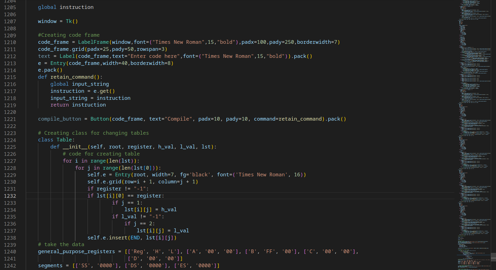
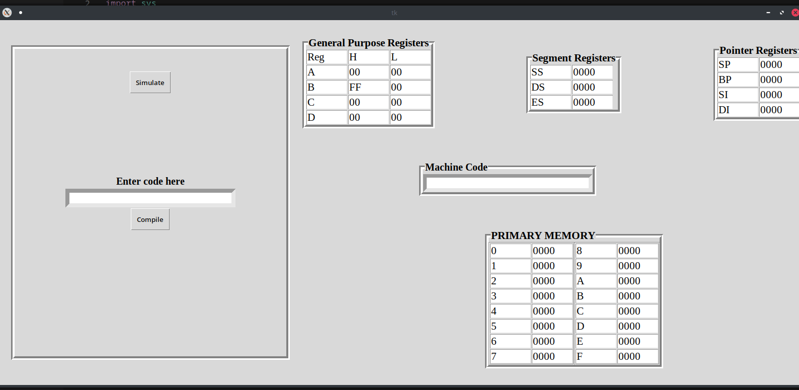
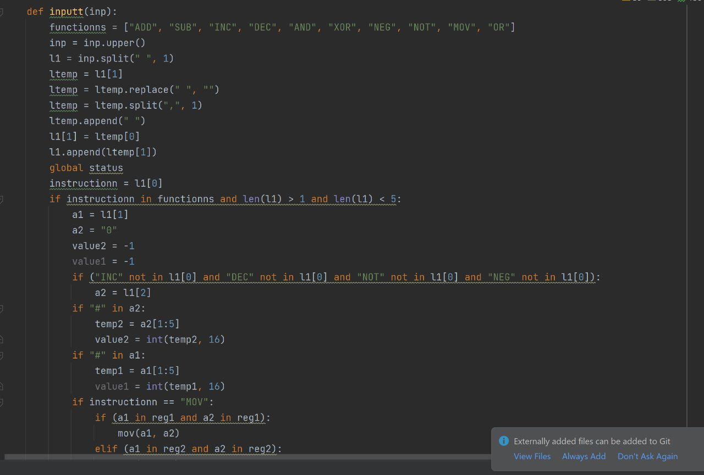
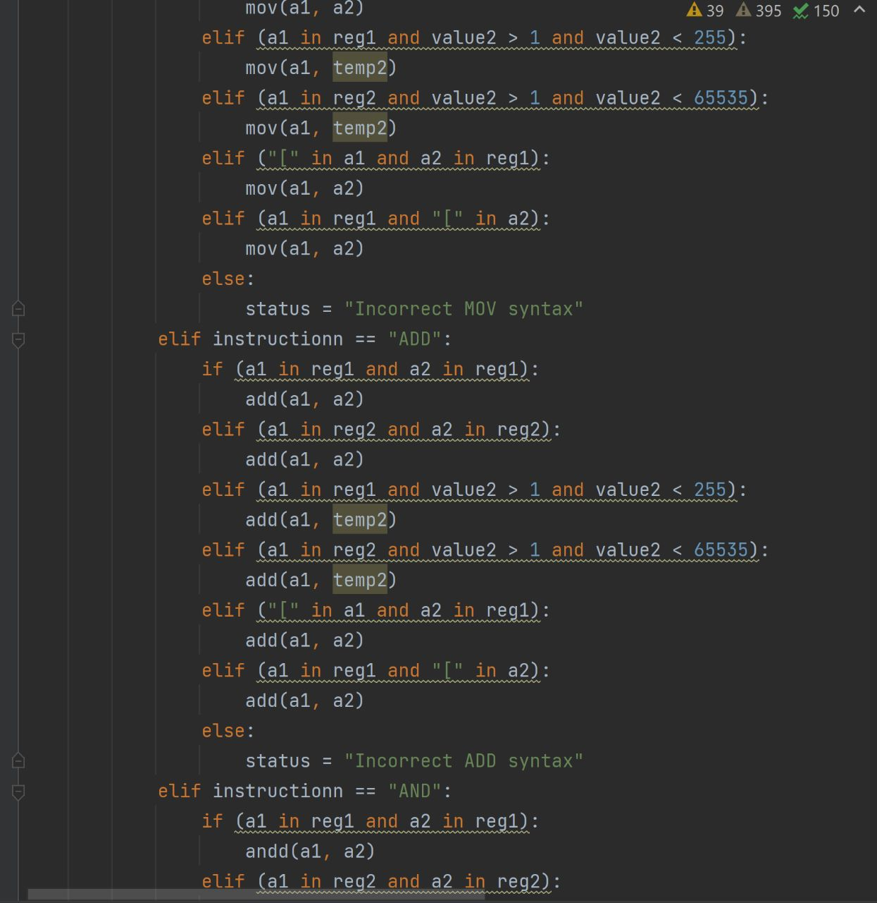
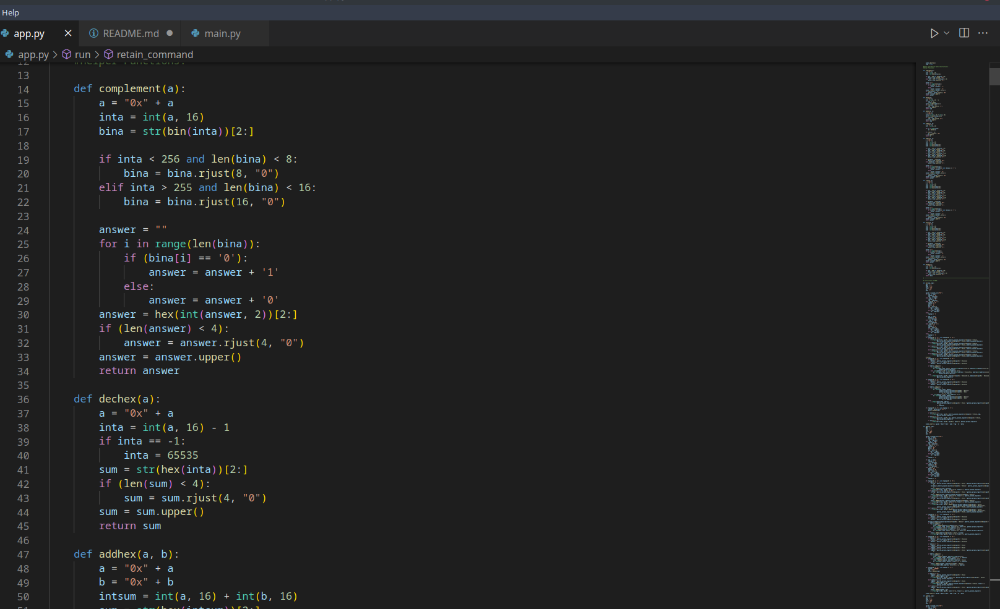
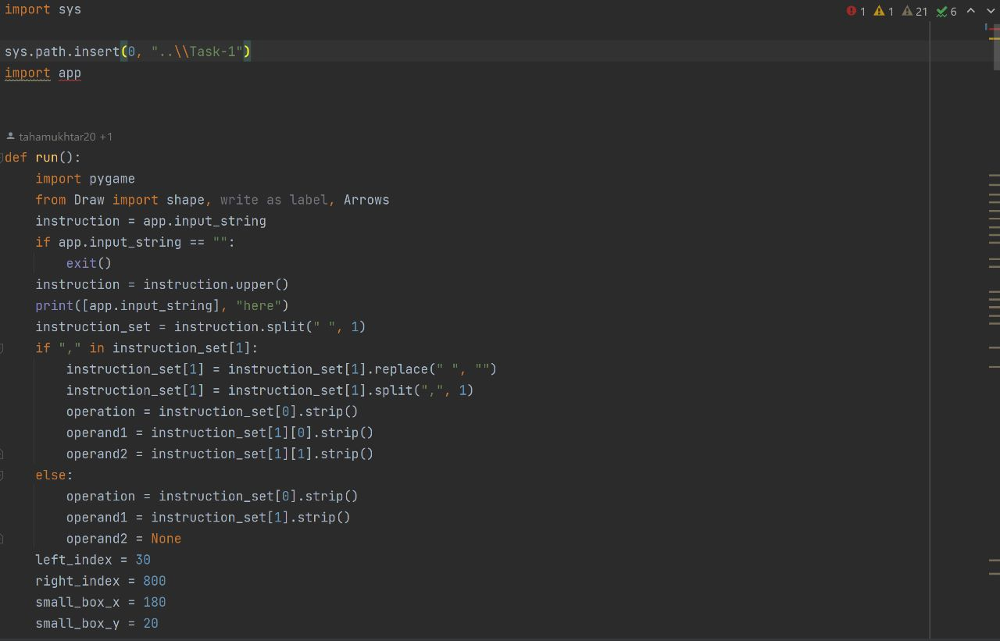
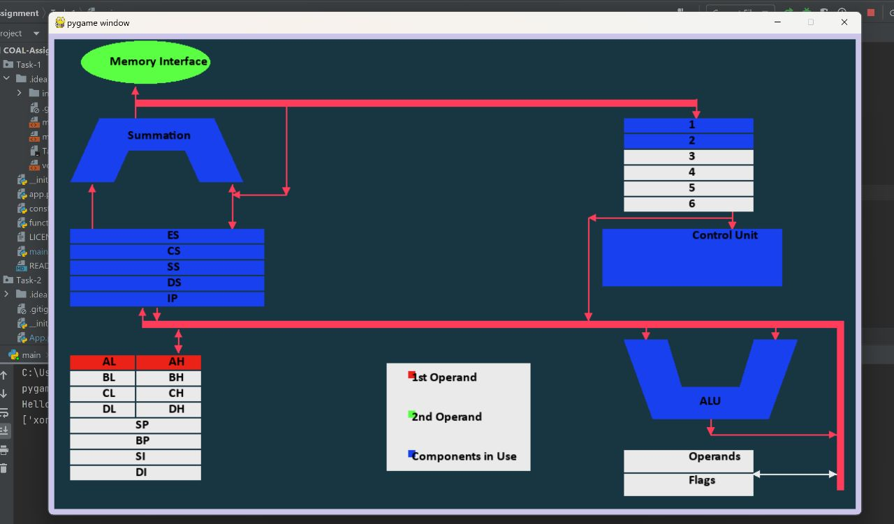

## Technology Used
- Python 
- Tkinter 
- Pygame

## Name of people with their work on project
- **GUI of Task-1 and basic GUI(shapes) of Task-2 -> Muhammad Hassan Bin Adeel**

    
    

- **Constraints of Task-1 and debugging of Task-2 -> Bashar Siddiqui**

    
    

- **Functionality of operations in Task-1 and Task-2 -> Syed Hashir Ahmed Kazi and Mohsin Khan**

    
    

- **Debugging of Task-1 and Task-2 GUI and Logic -> Muhammad Taha Mukhtar**

    
    

### GUI
- Displaying input box
- Displaying all registers and memory
- Giving access to every register and memory element to logic builders

### Constraints
- Checking user input according to assembly language rules
- Not running and throwing error if instruction does not follow the rules
- Run command iff all rules followed

## Code Logic
- Calculation of machine code according to user input
- Calculation and assignment of register values according to user input
- Helps in simulation of instruction (in Task-2) according to 8086

## Commands Working
- 11 commands working in Task-1
- All 15 commands working in Task-2
- If command not working in Task-1, then click on simulate button and it will work in Task-2
- Do not enter ax in mul,imul,div,idiv as constraint missing in task-1 but again it does work in Task-2

## Example use of all instructions
1. MOV 
    - mov ax,bx
    - mov ax,[1]
    - mov [1],ax
2. Increment 
    - inc ax
3. Decrement 
    - dec ax
4. Negate
    - neg ax
5. XOR
    - xor ax,bx
6. AND
    - and ax,bx
7. OR
    - or ax,bx
8. NOT
    - not ax
9. ADD
    - add ax,bx
10. SUB
    - sub ax,bx
11. COMPLEMENT
    - comp ax
12. MUL
    - mul bx (Task-1 not working)
13. IMUL
    - imul bx (Task-1 not working)
14. DIV
    - div bx (Task-1 not working)
15. IDIV
    - idiv bx (Task-1 not working)
